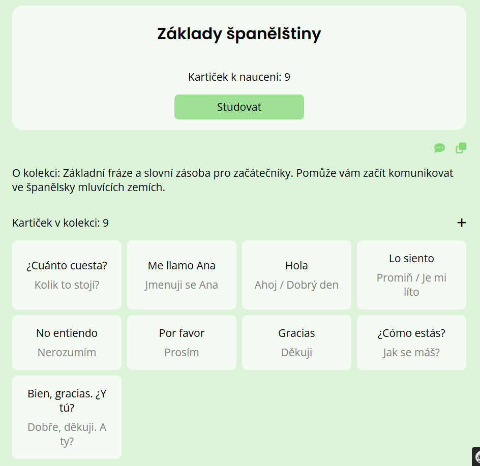
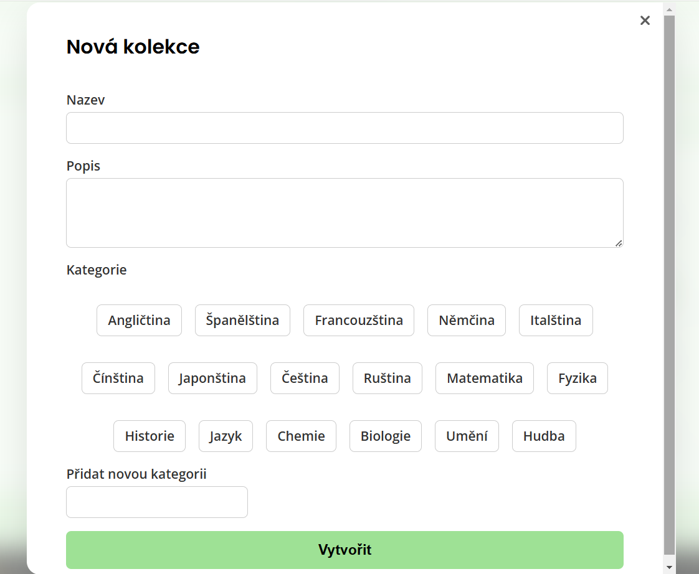
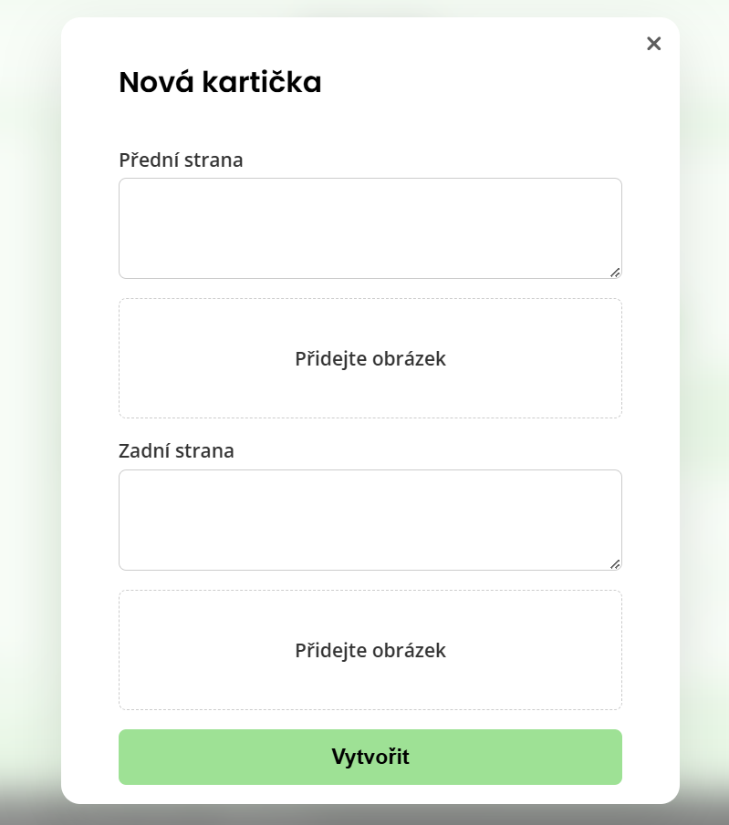
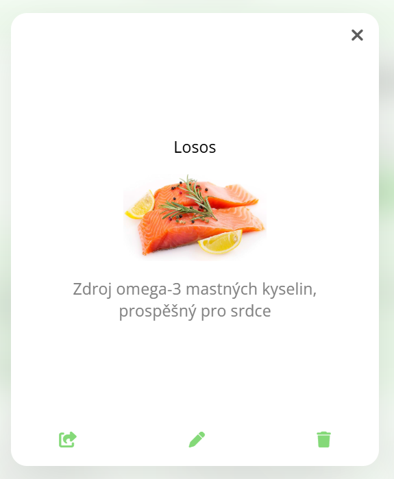
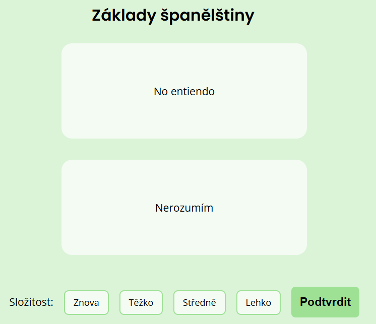
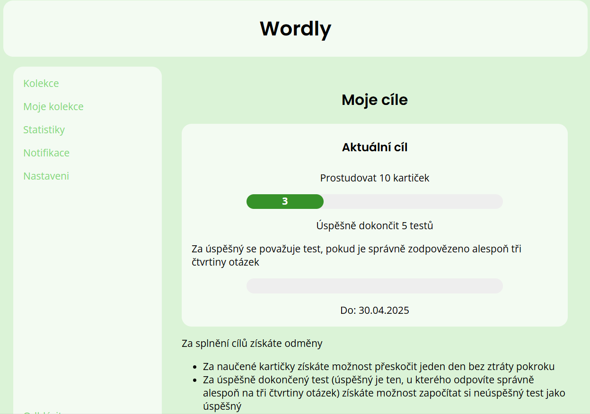
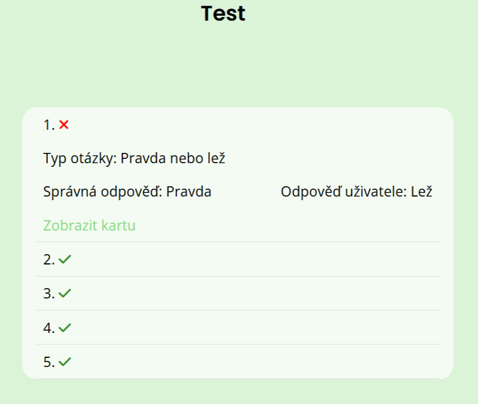
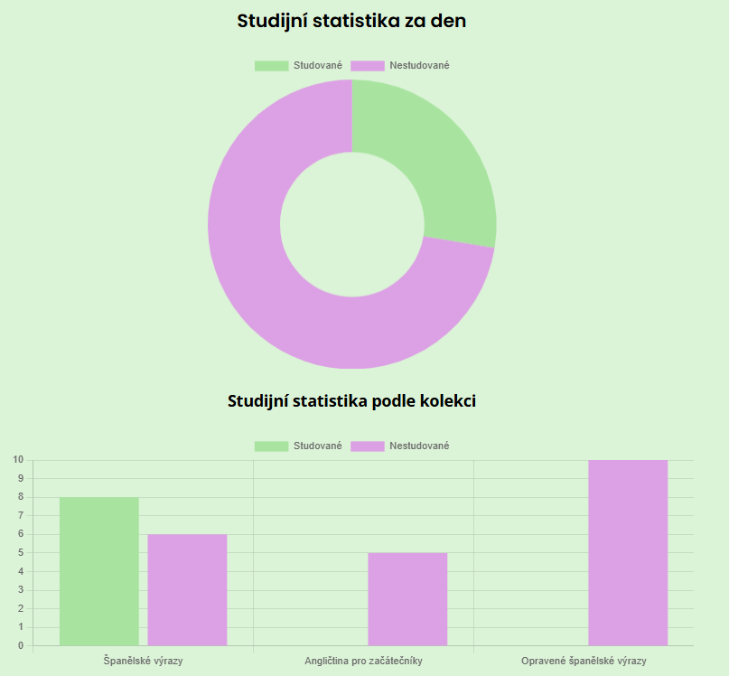

# Web Application for Learning Words and Technical Terms

This project was created as a **Bachelor’s thesis** focused on modern digital education.  
The application is designed for effective vocabulary and terminology learning using **digital flashcards**, combining spaced repetition, quizzes, and gamification.

---

## Key Features

- **Digital Flashcards** – each card has two sides (question–answer) and can include text as well as images.
- **Collections** – organize flashcards into thematic groups, with options to manage and share them.
- **Spaced Repetition** – the system tracks memory retention and dynamically schedules reviews.
- **Interactive Quizzes** – various question types (multiple choice, fill-in-the-blank, true/false).
- **Gamification** – weekly goals, rewards, and bonuses to boost motivation and consistency.
- **Progress & Statistics** – clear charts and stats by collection and daily activity.

---

## Technologies Used

- **Backend:** PHP (Symfony), Doctrine ORM
- **Frontend:** HTML, Twig, CSS, JavaScript
- **Database:** PostgreSQL
- **Other:** responsive design, usability testing

---

## Application Screenshots

### Collections and flashcards

### Spaced Repetition

### Weekly Goals

### Quiz Mode

### Progress Tracking

---

## Author

This project was created as a **Bachelor’s thesis** in the field of **Web Engineering**.  
Author: Sugako Aleksandra
